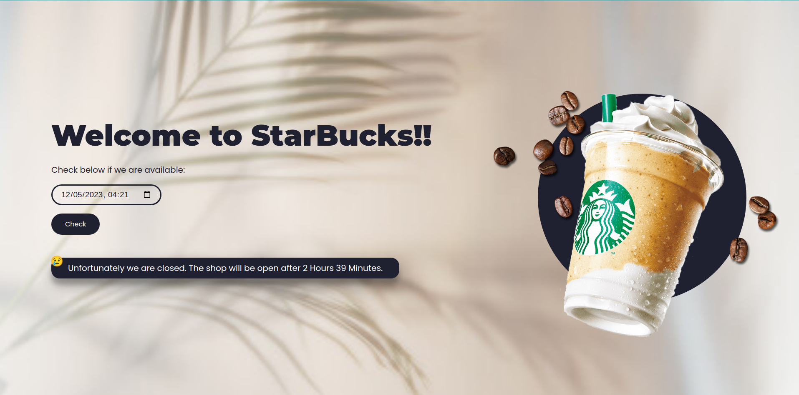
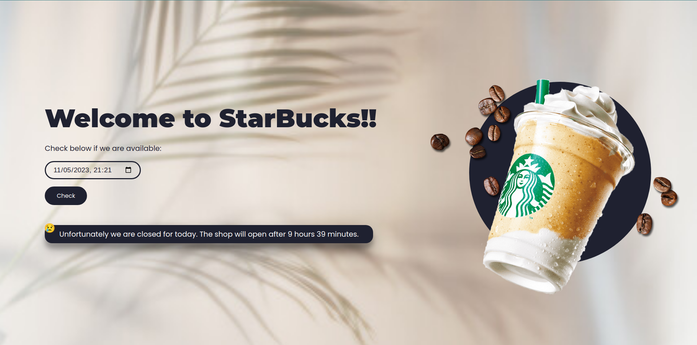

# practical_2

## 📝 Table of Contents

- [AIM](#aim)
- [Phase](#phase)
- [Usage](#usage)
- [Output](#output)

<br/>

## 🏁 AIM <a name = "aim"></a>

Prepare a program, which will tell us the shop open time.

Let's say, there is a shop which has it's open and close time.
The Open and close time may vary based on days. As a user we need to run the script and the script will tell us the status of the Shop.

<br/>

> ### ⛏️ Dependencies

- EJS
- Express

<br/>

## 🕖 Phase <a name = "phase"></a>
### Phase 2
```
If shop is closed, when it will be open next time.
(You need to give the response in Hours)
```
<br/>

## 🎈 Usage <a name = "usage"></a>
Clone the repo using below command:<br/>
<code>$ git clone (web URL)</code><br/>

<br/>

Then open the terminal and run the below command:<br/>
<code>$ nodemon index.js</code><br/>

<br/>

and then go to "localhost:3000" to see the output.
<br/>

<br/>

## 🎉 Output <a name = "output"></a>

### Possible outputs
<pre>
Output-1 [if Shop is Open]:
  => Open, The shop will be closed within XYZ Hrs

Output-2 [if Shop is Closed]:
  => Closed. The shop will be open after XYZ Hrs
</pre>
<br/>

<ol>
    <li>Home Page</li><br/>
    <br/><br/>
    <li>If entered day exists in shop's schedule</li><br/>
    <ul>
        <li>If entered time is before opening time:</li><br/>
        <br/><br/>
        <li>If shop is open on entered time:</li><br/>
        <br/><br/>
        <li>If entered time is after closing time:</li><br/>
        <br/><br/>
    </ul>
    <li>If entered day does not exist in shop's schedule</li><br/>
    <br/><br/>
</ol>

##  ✍️ Author: ISHAN HARKHANI